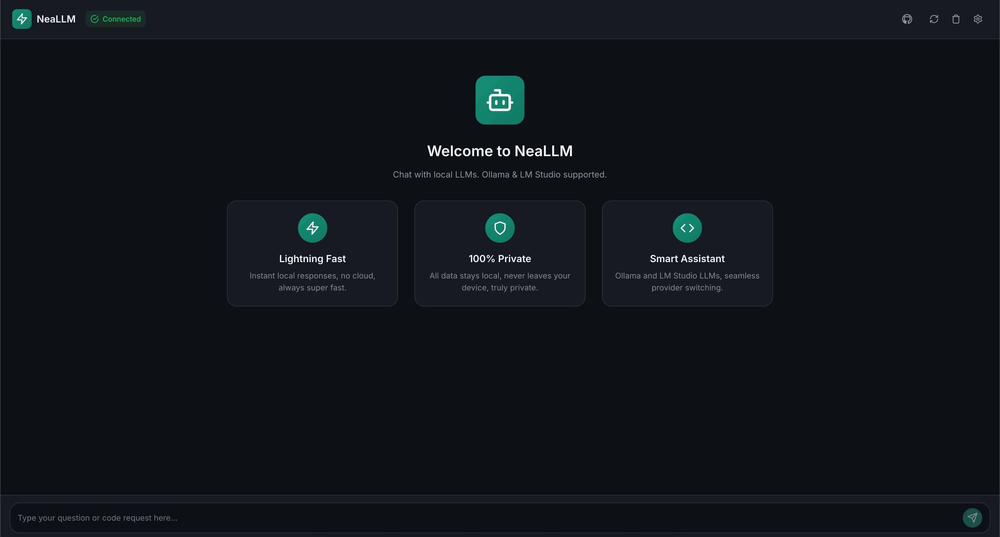
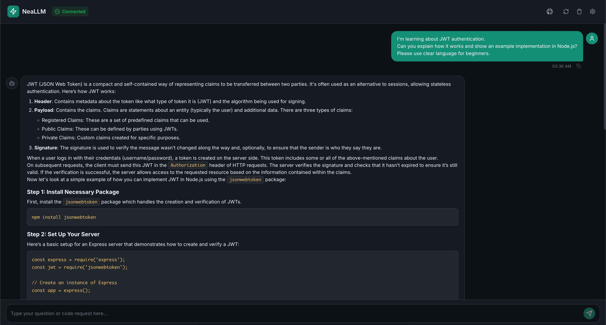

# ⚡ NeaLLM



NeaLLM is a **local LLM chat assistant** supporting **Ollama** and **LM Studio**. Enjoy a fast, modern, and private chat UI — your AI assistant runs fully on your own device, with no cloud or data sharing.

## 🚀 Features

- ⚡ **Lightning Fast:** Instant local responses, no cloud, always super fast.
- 🔒 **100% Private:** All data stays on your device—nothing is sent to the cloud.
- 🤖 **Smart Assistant:** Seamlessly switch between Ollama and LM Studio LLMs.

## 🖥️ Preview

Initial NeaLLM home screen:


## 🛠️ Technology Stack

- **Frontend:** [Vite](https://vitejs.dev/), [React](https://reactjs.org/)
- **Backend:** Connects to local LLMs via API (Ollama, LM Studio)

## ⚙️ Installation

1. **Clone the repository:**
    ```bash
    git clone https://github.com/NeaDigitra/NeaLLM.git
    cd NeaLLM
    ```

2. **Install dependencies:**
    ```bash
    npm install
    # or
    yarn
    ```

3. **Run the app:**
    ```bash
    npm run dev
    # or
    yarn dev
    ```

4. **Open in your browser:**
    ```
    http://localhost:5173
    ```

## 🧩 Configuration

- **Ollama:** Make sure [Ollama](https://ollama.com/) is running locally.
- **LM Studio:** Or, run [LM Studio](https://lmstudio.ai/) and point NeaLLM to the local API.
- Configuration can be managed from the app settings (gear icon).


## 📄 License

MIT © NeaDigitra